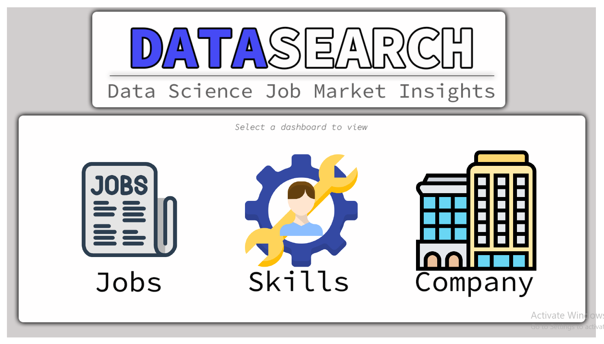
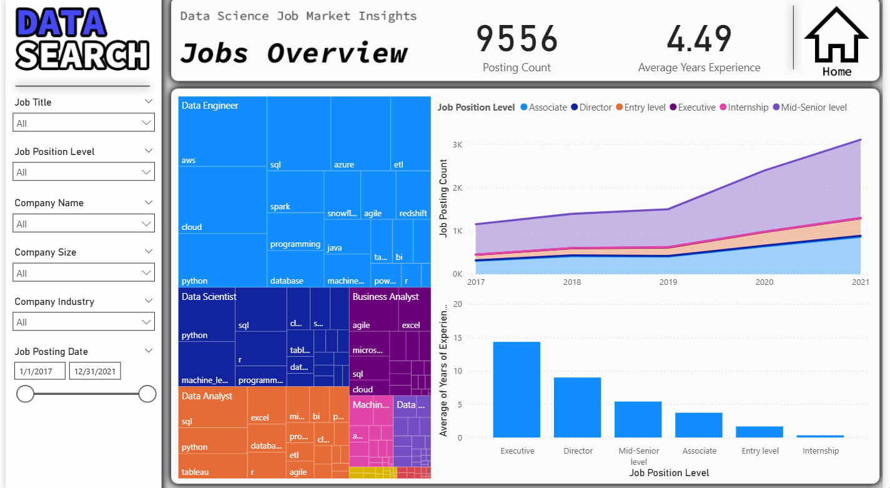
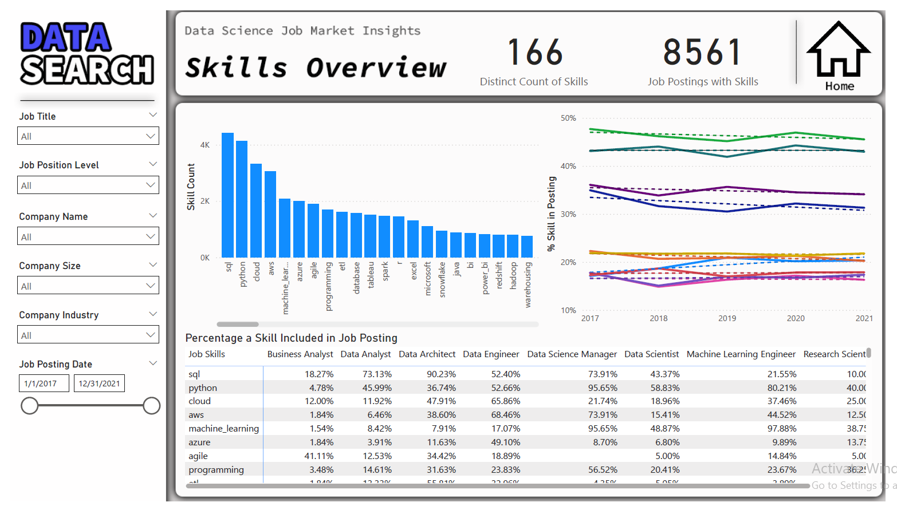
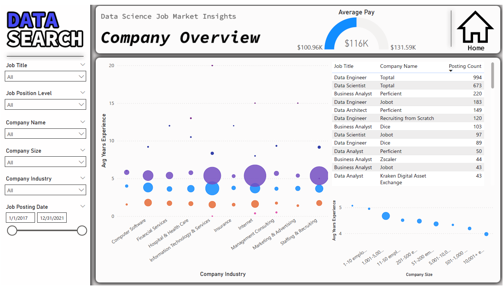

# Analyzing Jobs Market 

# DataSearch: Data Science Job Market Insights

## 📋 Project Overview
DataSearch is a dynamic Power BI business intelligence solution designed to track, analyze, and uncover macroeconomic trends within the data science and tech employment sectors from 2017 through 2021. 

By analyzing thousands of job postings, this project provides actionable insights into salary shifts, global talent demand patterns, company distribution across major industries, and critical technical skills needed for roles such as Data Analysts, Data Engineers, and Data Scientists.

---

## 🚀 Key Features & Layout

The interactive dashboard is split into 4 core pages for seamless exploration:

### 1. Home Dashboard

* A high-end central landing matrix utilizing custom vector UI tiles to route users seamlessly across specialized analytics modules (Jobs, Skills, and Company Overviews).

### 2. Jobs Overview

* **Market Distribution Matrix:** Incorporates an intricate hierarchical Treemap comparing major tech roles and their foundational skill sub-trees (e.g., matching SQL, Python, and Tableau to Data Analyst postings).
* **Volumetric Forecasting:** An area trend chart tracking historical hiring shifts over time, segmented dynamically by seniority levels (from Internships up to Executive positions).
* **Experience Correlation:** A clear bar chart mapping structural seniority against expected minimum industry experience metrics.

### 3. Skills Overview

* **Skill Density Matrix:** A specialized Pareto-style column chart identifying the top core technologies (SQL, Python, Cloud infrastructure) dominating modern tech listings.
* **Penetration Breakdown:** A dynamic cross-tabulated heatmap showing exactly how critical a skill is per role (e.g., showcasing that SQL appears in over 73% of Data Analyst postings and 90% of Data Architect listings).
* **Trend Over Time:** Trajectory line charts monitoring whether specific framework demands are rising or stabilizing year-over-year.

### 4. Company Overview

* **Market Aggregations:** Displays central KPI cards tracking average salaries alongside a distribution layout of market caps.
* **Industry Clusters:** A multi-dimensional bubble chart analyzing Average Years of Experience versus industry sectors, scaled proportionally by active posting volume.
* **Firmographic Distribution:** Scatter-trend mappings analyzing hiring activity patterns relative to company sizes (ranging from seed-stage startups to enterprises with 10K+ employees).

---

## 🛠️ Data Modeling & DAX Measures

To evaluate penetration density and salary distributions efficiently across high-volume job arrays, the model leverages specialized semantic metrics.

### Core DAX Measures Included:

* **Salary Standardization Baseline:**
```dax
Average Pay = ('Job Postings'[Maximum Pay] + 'Job Postings'[Minimum Pay]) / 2
```

* **Market Salary Aggregation:**
```dax
Average of Average Pay = AVERAGE('Job Postings'[Average Pay])
```

* **Skill Demand Penetration Rate:**
```dax
% Skill in Posting = [Skill Count] / [Posting Count]
```

## 💡 Key Analytical Insights
**The Core Technical Trio:** Across the entire data ecosystem, SQL, Python, and Cloud Infrastructure (AWS/Azure) emerge as non-negotiable fundamentals, maintaining the highest market density.

***Role-Specific Penetration:** Job matrix filtering reveals that SQL is mandatory for database-heavy roles, showing up in 73.13% of Data Analyst roles and 90.23% of Data Architect roles.

**Hiring Trajectories:** Volume trend monitoring demonstrates a massive acceleration in mid-to-senior level recruitment from late 2019 onwards, reflecting rapid enterprise digital adoption.

**The Experience Premium:** Operational analytics show a stark variance in experience prerequisites; Executive roles demand a baseline average of nearly 15 years of experience, whereas Entry-level positions remain accessible at under 2 years.

## 📂 Repository Structure

├── Visuals/               # Home.png, Jobs_Overview.png, Skills_Overview.png, Company_Overview.png
├── DataSearch_Model.pbix  # Complete Power BI Desktop File
└── README.md              # Project Documentation


